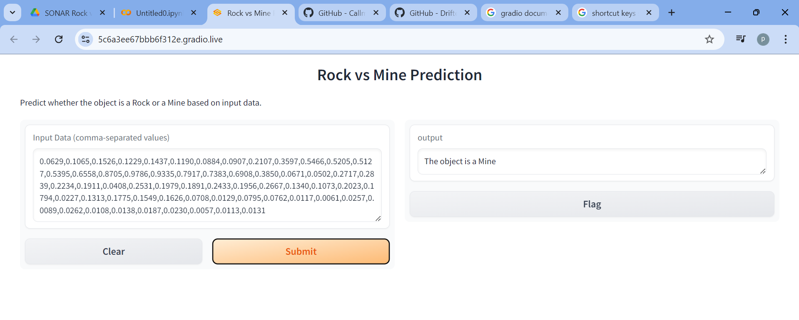
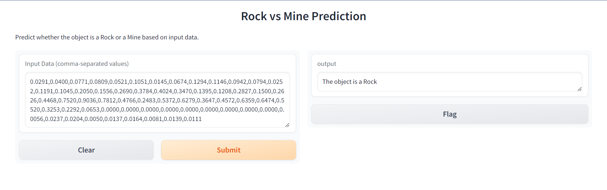

# SONAR Rock vs Mine Prediction

This project focuses on the classification of sonar signals to predict whether they bounce off a rock or a metal mine. Using the Logistic Regression algorithm, this project serves as a practical example of applying machine learning techniques to real-world problems, particularly in the field of geology and underwater exploration.

## Project Overview

Sonar, short for Sound Navigation and Ranging, is a technique that uses sound propagation to navigate, communicate with, or detect objects on or under the surface of the water. The sonar signals reflect differently depending on the materials they bounce off, such as rocks or metallic objects like mines. Correctly identifying these materials is critical in various domains, including naval operations and geological exploration.

This project aims to build a predictive model that can classify sonar returns as either rocks or mines based on the analysis of sonar signal data. We have employed the Logistic Regression algorithm, a widely used statistical method for binary classification tasks.

## Dataset

The dataset used for this project is sourced from Kaggle, titled **“Sonar Dataset”**. It contains 208 observations with 60 features each, representing the energy of the sonar signal at various frequencies. The dataset is well-suited for binary classification, as it has a balanced distribution of two classes: Rock (labeled as 'R') and Mine (labeled as 'M').

You can find the dataset on Kaggle [here](https://www.kaggle.com/datasets/). 

### Features

- **Input Features:** 60 numerical features representing the energy at different frequency bands.
- **Output Feature:** A binary output (Rock or Mine).

## Algorithm: Logistic Regression

Logistic Regression is a fundamental algorithm in the field of machine learning, especially when it comes to binary classification problems. It models the probability of a binary outcome as a function of a linear combination of the input features.

### Why Logistic Regression?

- **Simplicity and Efficiency:** Logistic Regression is straightforward to implement and interpretable, making it a good starting point for binary classification tasks.
- **Probability Estimates:** It provides probabilistic outputs, which are useful for decision-making.
- **Feature Interpretation:** The coefficients of the model can give insights into the influence of each feature on the classification outcome.

### Model Implementation

The Logistic Regression model was implemented using the `scikit-learn` library in Python. The model was trained on 70% of the dataset and tested on the remaining 30% to evaluate its performance.

### Model Performance

The performance of the model is evaluated using various metrics:

- **Accuracy:** Measures the proportion of correct predictions.
- **Precision:** The number of true positive results divided by the number of all positive results.
- **Recall:** The number of true positive results divided by the number of positives that should have been returned.
- **F1-Score:** The harmonic mean of precision and recall, providing a balance between the two.

The model achieved a reasonable accuracy, making it a reliable tool for predicting whether a sonar signal has bounced off a rock or a mine.

## Web Application: Gridio

To make this model accessible and easy to use, we have deployed it as a web application using Gridio. Gridio allows us to create an interactive interface where users can input new sonar signal data and receive predictions in real-time.

### Features of the Web App

- **User Input:** Users can input the 60 sonar signal features manually or through a CSV file.
- **Real-time Prediction:** Upon submitting the data, the web app will instantly classify the input as either a rock or a mine.
- **Interactive Interface:** The app provides an intuitive and user-friendly interface that requires no prior technical knowledge.

### How to Use

1. **Access the Web App:** You can access the app via the link provided (link to be included).
2. **Input Data:** Enter the 60 sonar features into the provided fields or upload a CSV file.
3. **Get Prediction:** Click on the "Predict" button to receive the classification result.

## Conclusion

The SONAR Rock vs Mine Prediction project exemplifies the application of machine learning in solving real-world problems. By leveraging Logistic Regression, we have developed a model that can effectively classify sonar signals, aiding in tasks such as underwater exploration and mine detection. The deployment of this model as a web app via Gridio ensures that it is accessible and easy to use for a wide range of users.

This project demonstrates not only the potential of machine learning but also the importance of model deployment in making these solutions practical and widely usable.

---

This updated README includes your project images, providing a more visual and engaging description of your project.